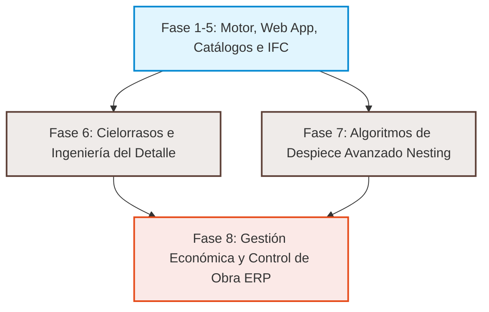

# 🚀 Plan de Expansión Estratégica: Drywall Calc (Fases 6 a 8)
*Enriquecido con especificaciones técnicas, reglas de montaje y consumos basados en los manuales técnicos oficiales de **Gyplac (Eternit Perú)**, **Guías Knauf (Sistemas D112/D113)** y **Pladur**.*

Este documento complementa el [roadmap original (Fases 1 a 5)](file:///c:/Users/JF/Desktop/drywall/roadmap_fases_1_a_5.md) con un análisis profundo de las necesidades reales de los instaladores, contratistas y presupuestadores de drywall en Perú y Latinoamérica. Propone tres nuevas fases evolutivas para transformar la aplicación de una calculadora avanzada a un **sistema integral de despiece, costeo y control de obra** apegado a normas técnicas internacionales (ASTM C840) y de fabricantes.

---

## 🗺️ Visión General de la Expansión

---

## Techo Continuo suspendido 1. 🪵 FASE 6 — Cielorrasos, Detalles y Volumetría Especial (Sistemas Horizontales)

> **Problema del Usuario**: En obras reales, el cielorraso suspendido (fijo o junta invisible) representa entre el 40% y 60% del volumen del proyecto. Cotizarlos simplemente por metro cuadrado ($m^2$) ignora la estructura de cuelgue y los perfiles de doble nivel (cruzados). Un cálculo inadecuado provoca fisuras en las juntas por deflexión o sismos, o un exceso costoso de perfilería por falta de modulación precisa.

### Especificaciones de Manuales Técnicos Incorporadas:
*   **Knauf D112 (Estructura Metálica de Doble Nivel)**: Requiere perfiles portantes superiores (principales) y perfiles secundarios inferiores cruzados con conectores de anclaje rápido.
*   **Modulación de Suspensión (Cuelgue)**: Puntos de anclaje a losa (varillas roscadas, alambres galvanizados N°12 o conectores rígidos) distanciados a máximo $1.20\text{ m}$ entre sí.
*   **Modulación de Perfiles**:
    *   **Perfiles principales (Portantes)**: Separación máxima de $0.90\text{ m}$ a $1.20\text{ m}$ entre ejes.
    *   **Perfiles secundarios (Omega o Parante)**: Separación a $0.407\text{ m}$ ($16"$) para placas colocadas longitudinalmente (o $0.50\text{ m}$ en sistema métrico Knauf) y $0.61\text{ m}$ ($24"$) para placas en sentido transversal.
*   **Encuentros Perimetrales**: Perfil angular de acero galvanizado de $20 \times 20\text{ mm}$ o $25 \times 25\text{ mm}$ fijado a los muros de soporte mediante clavos de impacto o tarugos plásticos de 1/4" cada $0.60\text{ m}$.

---

### Épicas y Casuísticas a Resolver:

#### Épica 30 — Motor de Cálculo de Cielorrasos Planos (Knauf D112 / Pladur Techo Continuo)
- **30.1** Definir el tipo `Cielorraso` en el catálogo y su esquema Zod, soportando dos variantes principales de montaje:
  - **Sistema Unidireccional Directo (Perfil Omega)**: Fijado directamente a vigas/losa de madera o metal mediante clips o tornillos. Separación estándar a $0.407\text{ m}$ o $0.50\text{ m}$.
  - **Sistema Bidireccional Suspendido (Doble Nivel)**: Estructura de parantes cruzados (principales y secundarios) vinculados con conectores de suspensión y colgados de la losa superior.
- **30.2** Algoritmo de distribución geométrica de elementos de suspensión:
  - Distribución lineal de los perfiles portantes (principales) alineados a la dimensión más corta para optimizar.
  - Distribución transversal de los perfiles secundarios (omegas o parantes en C) con cálculo de empalmes lineales (conectores de prolongación).
  - Cálculo de la matriz de colgadores (velas o varillas con resorte de regulación) a losa cada $1.00\text{ m}$ o $1.20\text{ m}$ sobre los perfiles principales.
- **30.3** Regla de bordes: El primer colgador y perfil debe estar posicionado a una distancia no mayor a $0.30\text{ m}$ del muro perimetral para evitar deflexiones en las esquinas del cielorraso.

#### Épica 31 — Cenefas, Cajones de Luz e Hornacinas (Detalle de Borde y Volumetría)
- **31.1** Implementación de "Detalles Volumétricos":
  - **Cenefas / Cajones perimetrales**: Estructuras en L o U invertida que combinan tramos de muro corto (fajas verticales) con pequeños cielorrasos (fajas horizontales). Requieren cálculo de esquineros de refuerzo y perfiles riel y parante combinados.
  - **Hornacinas / Nichos**: Descuentos de placas en el muro principal, agregando perfiles de refuerzo internos en las esquinas entrantes y salientes.
- **31.2** Cálculo automático de **Esquineros / Cantoneras plásticas o metálicas** y **Perfiles J (o revelaciones)** de terminación para cantos expuestos.

#### Épica 32 — Interfaz y Visualizador 3D para Cielorrasos y Volumetría
- **32.1** Extender el visualizador 3D (`@drywall-calc/bim-viewer` con Three.js) para renderizar el entramado de perfiles de techo (canales portantes, omegas, alambres de suspensión y placas atornilladas boca abajo).
- **32.2** Herramientas interactiva para añadir cenefas dibujando un trazo sobre la planta 2D.

---

## 📐 FASE 7 — Optimización Avanzada de Despiece (Nesting 1D/2D)

> **Problema del Usuario**: Las mermas en perfiles y placas son la mayor pérdida oculta de un subcontratista. Si se calcula la longitud total y se divide entre el largo comercial de la barra ($3.00\text{ m}$), el resultado ignora los cortes y retazos inutilizables. En obra, un parante de $2.80\text{ m}$ deja un retazo de $0.20\text{ m}$ que suele ir a la basura, mientras que para los dinteles se compran barras nuevas por no saber si hay retazos disponibles compatibles.

### Especificaciones de Manuales Técnicos Incorporadas:
*   **Unión y Empalme de Montantes (Muros Altos)**: Según el manual de Gyplac/Tupemesa, para alturas mayores a $3.00\text{ m}$ (largo de barra estándar), el empalme de dos parantes en C debe hacerse mediante una sección telescópica de traslape mínimo de $0.30\text{ m}$ (en perfiles 0.45mm) o de $0.45\text{ m}$ (en perfiles estructurales de 0.90mm) fijado con 4 tornillos cabeza wafer 7/16" a cada lado.
*   **Separación de Junta en Mochetas y Dinteles**: Las juntas entre placas no deben coincidir con las esquinas de los vanos (puertas o ventanas) para evitar fisuras por vibración. La placa debe cortarse en forma de "pistola" o L alrededor del vano. Esto cambia la geometría del nesting y genera retazos especiales.

---

### Épicas y Casuísticas a Resolver:

#### Épica 33 — Nesting 1D de Perfiles Metálicos (Optimización de Barras y Empalmes)
- **33.1** Implementar un algoritmo de **empaquetamiento unidimensional (1D Bin Packing)** en `core-engine` para agrupar todas las longitudes requeridas en obra:
  - Alturas exactas de parantes (verticales).
  - Dinteles de puertas y antepechos de ventanas (horizontales).
  - Refuerzos de uniones y jambas dobles.
  - *Regla de Altura Máxima*: Si la altura del muro supera el largo comercial de la barra ($3.00\text{ m}$), el algoritmo debe descomponer el perfil en dos segmentos considerando el traslape normativo ($0.30\text{ m}$ o $0.45\text{ m}$ según catálogo).
- **33.2** Retornar el **Pliego de Corte de Perfiles**:
  - Lista exacta de barras comerciales a comprar (ej: "Comprar 50 barras de 3.00m").
  - Instrucciones de corte para el operario (ej: "Barra 1: Cortar 1 tramo de 2.60m + 1 tramo de 0.40m para dintel. Desperdicio: 0.00m").
  - Minimización sistemática de la merma agregando un inventario de barras sobrantes reutilizables en el mismo proyecto.

#### Épica 34 — Nesting 2D Real de Placas y Reutilización de Retazos
- **34.1** Migrar del descarte simplificado (`recortada: true` = 1 placa completa perdida) a un **algoritmo de Nesting 2D rectangular con guillotina**:
  - Si una ventana de $1.20\text{ m} \times 1.20\text{ m}$ recorta una placa de $1.22\text{ m} \times 2.44\text{ m}$ a la mitad, el retazo sobrante de $1.22\text{ m} \times 1.24\text{ m}$ se guarda en la "bolsa de retazos virtual".
  - El algoritmo intentará ubicar este retazo en las zonas de mocheta, dinteles o muros cortos del mismo proyecto antes de despachar una placa nueva completa del catálogo.
- **34.2** Restricción técnica de obra: Controlar la orientación de la fibra/hilo de la placa (no colocar placas horizontales mezcladas con verticales en el mismo paño para evitar fisuras por dilatación térmica).

#### Épica 35 — Reporte de Planos de Corte para Taller / Obra
- **35.1** Generar un plano técnico interactivo y descargable en SVG/PDF que muestre visualmente a los instaladores el diagrama de corte de cada placa y perfil en el taller. Esto reduce el error humano del operario en obra.

---

## 💼 FASE 8 — Presupuestos Avanzados, Logística y ERP de Obra

> **Problema del Usuario**: Un contratista no solo vende materiales; vende un sistema instalado. Necesita calcular el costo de la mano de obra, las herramientas menores (cuchillas, lijas, andamios), el flete y, críticamente, programar los despachos. En obras medianas o grandes, el drywall no se despacha todo el primer día por falta de espacio en obra; se despacha por fases (Estructura -> Emplacado Cara A -> Aislante -> Cierre -> Acabado).

### Parámetros de Consumo Técnico Real (Fórmulas Integradas):
*   **Fijación de Placas (Tornillería)**:
    *   Tornillos drywall de 1" punta fina (para perfilería 0.45mm) o punta broca (para perfilería 0.90mm).
    *   *Densidad de atornillado*: Separación máxima de $0.30\text{ m}$ en parantes centrales y $0.20\text{ m}$ en los bordes de la placa. Equivale a aproximadamente **30 tornillos por placa** ($10\text{ tornillos por } m^2$ por cara).
    *   *En multicapa*: La primera capa se fija cada $0.50\text{ m}$ (tornillo de 1") y la segunda capa se fija cada $0.25\text{ m}$ (tornillo de 1 5/8" o 2").
*   **Tratamiento de Juntas (Masilla y Cinta)**:
    *   *Masilla Lista para Usar (Pasta)*: Consumo de **1.50 a 1.80 kg por $m^2$** de placa instalada para 3 manos de masillado (pegado de cinta, relleno y enlucido completo).
    *   *Cinta de papel microperforada*: Consumo de **1.60 a 1.80 ml de cinta por $m^2$** de placa instalada.
*   **Fijaciones a Estructuras Base (Losa / Muros de Concreto)**:
    *   Clavos de impacto de 1" con fulminantes calibre 22 (color verde o amarillo según dureza del concreto) o tarugos de nylon de 1/4" con tornillo, espaciados cada **$0.60\text{ m}$ máximo** en rieles (soleras) perimetrales.

---

### Épicas y Casuísticas a Resolver:

#### Épica 36 — Módulo de APU (Análisis de Precios Unitarios) y Cotizador
- **36.1** Crear una base de datos local (con soporte de importación de tarifas) para desglosar:
  - **Mano de Obra (HH)**: Rendimiento por $m^2$ según tipo de elemento (un muro a $4.00\text{ m}$ de altura requiere andamios y rinde 30% menos que un muro estándar a $2.40\text{ m}$). Diferenciar costos de Operario, Oficial y Ayudante.
  - **Equipos y Andamiaje**: Costo de alquiler de andamios por día según altura del proyecto.
  - **Materiales Indirectos**: Desglose de consumibles (cuchillas de cúter, brocas para concreto, clavos de impacto, gas para clavadoras).
- **36.2** Generador de **Cotizaciones Comerciales**: Exportación a PDF de presupuestos estructurados con margen de ganancia, gastos generales e impuestos locales configurables.

#### Épica 37 — Logística de Despacho y Planificación por Fases de Instalación
- **37.1** Romper el listado de materiales único en una **secuencia temporal de instalación**:
  - **Fase A (Estructura y Anclajes)**: Rieles, parantes, tornillos de perfil-perfil (cabeza wafer 7/16"), clavos de impacto y fulminantes.
  - **Fase B (Emplacado Primera Cara)**: 50% de las placas y tornillos placa-perfil (trompeta 1").
  - **Fase C (Instalaciones y Aislamiento)**: Fibra de vidrio / lana de roca (colocada después de inspección eléctrica/sanitaria).
  - **Fase D (Emplacado Segunda Cara e Intermedios)**: Resto de placas, esquineros y tornillos.
  - **Fase E (Acabados)**: Cinta de papel, masilla en balde/caja, lijas.
- **37.2** Generar órdenes de compra independientes por fase para enviar al proveedor de materiales según avance programado.

#### Épica 38 — Control de Avance Físico Visual en Obra
- **38.1** Modo "Check-in de Obra" en la Web App (versión móvil optimizada):
  - El supervisor de obra hace clic sobre los muros o zonas del visor 3D para cambiar su estado (ej: `Planificado` ➔ `Estructurado` ➔ `Cerrado Cara A` ➔ `Aislado` ➔ `Terminado`).
  - **Valorización en tiempo real**: Generación automática de reportes de avance físico y valorizaciones económicas mensuales para presentar al cliente principal.

---

## 👥 Mapeo de Roles Técnicos de la Skill para estas Fases

| Rol Requerido | Fase | Función Clave | dedicación | Criterio de Selección |
|---|---|---|---|---|
| **Ingeniero de Geometría Computacional** | **Fase 7** (Nesting) | Desarrollo de algoritmos de despiece 1D/2D eficientes y optimización de desperdicios en tiempo real. | Full-Time temporal | Sólida experiencia en algoritmos de empaquetamiento, optimización combinatoria o CAD web. |
| **Consultor Técnico del Rubro (Drywallero Senior)** | **Fase 6 y 8** (Cielos y APU) | Definición de las reglas de carga de cielorrasos, rendimientos reales de mano de obra en LATAM y factores de rendimiento por altura. | Consultor Part-Time | Maestro instalador o supervisor de proyectos con +10 años en obras de drywall comerciales. |
| **UX/UI Product Designer** | **Fase 8** (ERP/Fases) | Simplificación de flujos complejos de presupuestos y control de avance móvil en obra. | Part-Time | Diseño de interfaces para software industrial, SaaS complejos o construcción (Procore, PlanGrid, etc.). |

---

## 🎯 Plan de Acción Inmediato para Iniciar la Expansión

1. **Reunión de Diseño con el Consultor Técnico**: Definir la tipología y marcas de cielorrasos suspendidos que se usan en la región (ej: perfiles de suspensión de Eternit vs. Knauf vs. marcas genéricas) para armar el primer borrador del catálogo de Cielorrasos.
2. **Desarrollo del Spike del Algoritmo 1D (Perfiles)**: Crear una prueba de concepto aislada en el paquete de utilidades de `core-engine` para tomar una lista de cortes de parantes y agruparlos en barras de $3.00\text{ m}$, evaluando la tasa de merma teórica versus la práctica.
3. **Validación del Modelo de Datos de Cielorrasos**: Modificar `@drywall-calc/catalog-schemas` para introducir las interfaces del sistema de suspensión sin romper la compatibilidad de los muros actuales.
